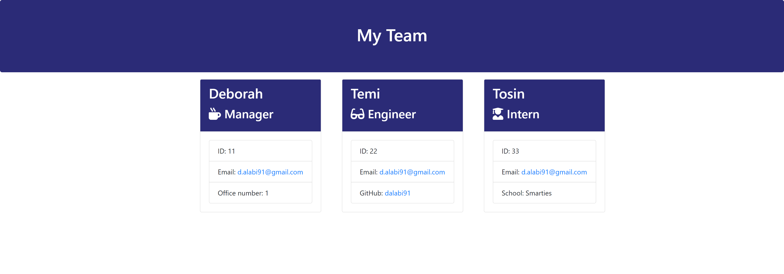

# Team-Profile-Generator

This application will take in information about employees on a software engineering team, and then generate an HTML webpage that displays summaries for each person.

https://github.com/dalabi91/Team-Profile-Generator/assets/152018805/24ac29ac-5db4-4e2f-8773-418165f9dccc

## User Story

As a manager, I wants to generate a webpage that displays my team's basic info so that a user has quick access to their emails and GitHub profiles.

## Acceptance criteria

- Create a command-line application that accepts user input using the provided starter code.
  - Create classes for each team member provided and export them. The tests for these classes (in the `_tests_` directory) must ALL pass.
    - The first class is an `Employee` parent class with the following properties and methods:
      - `name`
      - `id`
      - `email`
      - `getName()`
      - `getId()`
      - `getEmail()`
      - `getRole()`&mdash;returns `'Employee'`
    - The other three classes will extend `Employee`.
    - In addition to `Employee`'s properties and methods, `Manager` will also have the following:
      - `officeNumber`
      - `getRole()`&mdash;overridden to return `'Manager'`
    - In addition to `Employee`'s properties and methods, `Engineer` will also have the following:
      - `github`&mdash;GitHub username
      - `getGithub()`
      - `getRole()`&mdash;overridden to return `'Engineer'`
    - In addition to `Employee`'s properties and methods, `Intern` will also have the following:
      - `school`
      - `getSchool()`
      - `getRole()`&mdash;overridden to return `'Intern'`
    - Finally, although it’s not a requirement, consider adding validation to ensure that user input is in the proper format.
  - Write code in `index.js` that uses inquirer to gather information about the development team members and creates objects for each team member using the correct classes as blueprints.
    - When a user starts the application then they are prompted to enter the **team manager**’s:
      - Name
      - Employee ID
      - Email address
      - Office number
    - When a user enters those requirements then the user is presented with a menu with the option to:
      - Add an engineer
      - Add an intern
      - Finish building the team
    - When a user selects the **engineer** option then a user is prompted to enter the following and then the user is taken back to the menu:
      - Engineer's Name
      - ID
      - Email
      - GitHub username
    - When a user selects the intern option then a user is prompted to enter the following and then the user is taken back to the menu:
      - Intern’s name
      - ID
      - Email
      - School
    - When a user decides to finish building their team then they exit the application, and the HTML is generated.
  - Call the `render` function (provided for you) and pass in an array containing all employee objects;
    - The `render` function will generate and return a block of HTML including templated divs for each employee!
  - Create an HTML file using the HTML returned from the `render` function.
    - Write it to a file named `team.html` in the `output` folder.
    - You can use the provided variable `outputPath` to target this location.

---

## Installation

- To start with, check if you have Node.js installed on your system by typing [node -v] in the command line.
- If Node.js is not installed, visit the [Node.js website](https://nodejs.org/en) to install.
- Next, clone this project repository to your computer

## Usage

- make sure you are in the right folder in your terminal
- This application can be invoked by typing [node index.js] in the command line

Check out this [**demo video**](https://app.screencastify.com/v3/watch/RO0LG0m5mbPW4nTIiZVC) for visual instruction on usage

### Screenshot of App function

Generated page screenshot

## License

Please refer to the license in the repo.

## Badges

